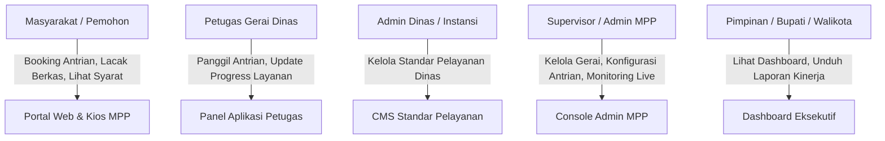
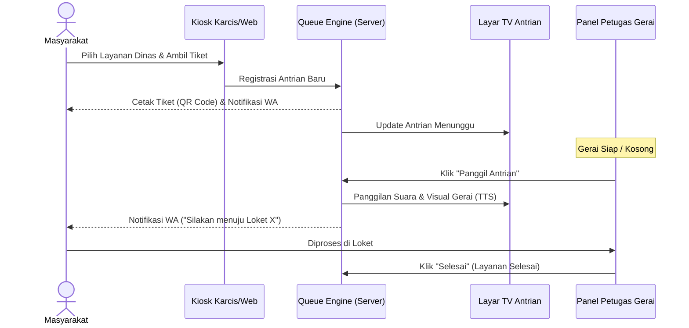
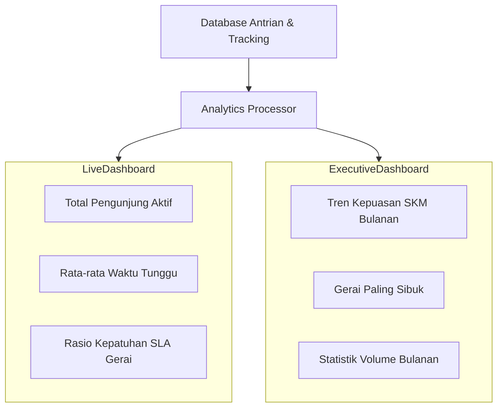
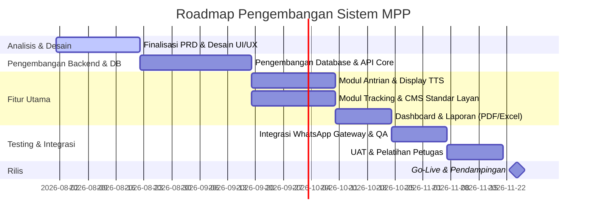

# PRODUCT REQUIREMENT DOCUMENT (PRD)
## Sistem Layanan Publik MPP (Mal Pelayanan Publik) Terintegrasi

| Kategori | Keterangan |
| :--- | :--- |
| **Nama Proyek** | Sistem Informasi & Layanan Publik MPP Digital |
| **Versi** | 1.0.0 |
| **Status** | Draft untuk Review |
| **Tanggal Pembuatan** | 16 Juli 2026 |
| **Pemilik Produk** | Tim Pengembang Sistem MPP |

---

## 1. Latar Belakang & Deskripsi Produk
Mal Pelayanan Publik (MPP) merupakan pusat pelayanan terpadu yang menyatukan berbagai gerai instansi pemerintah (Dinas Kependudukan, Dinas Perizinan, Imigrasi, Samsat, dll) dalam satu lokasi fisik. Selama ini, operasional MPP sering kali menghadapi kendala seperti antrian yang menumpuk, kurangnya transparansi proses penyelesaian berkas (pemohon tidak tahu status berkasnya sudah sampai mana), dan kesulitan dalam menyusun laporan kinerja layanan secara real-time.

**Sistem Layanan Publik MPP Digital** dirancang sebagai solusi berbasis web dan mobile untuk mendigitalisasi proses pelayanan di MPP. Sistem ini mengintegrasikan **Sistem Antrian Digital**, **Pelacakan Berkas/Layanan (Tracking Progress)**, **Katalog Standar Pelayanan Gerai**, **Dashboard Analitik Real-time**, serta **Generator Laporan Periodik** untuk mendukung pengambilan keputusan yang cepat dan berbasis data.

---

## 2. Tujuan & Sasaran (Objectives & Scope)
- **Transparansi**: Pemohon dapat melacak berkas mereka secara mandiri tanpa harus datang ke lokasi.
- **Efisiensi Waktu**: Mengurangi waktu tunggu fisik di lokasi melalui sistem booking antrian online dan notifikasi prediktif via WhatsApp.
- **Kepastian Layanan**: Masyarakat mendapatkan informasi yang jelas mengenai syarat, biaya, dan waktu proses sebelum datang ke MPP.
- **Evaluasi Kinerja**: Pimpinan MPP dan Kepala Daerah dapat memantau produktivitas setiap gerai dinas secara real-time.
- **Kemudahan Pelaporan**: Mengotomatisasi penyusunan laporan operasional (Harian, Bulanan, Semesteran) untuk evaluasi berkala.

---

## 3. Aktor & Peran (User Roles & Personas)

Sistem ini memiliki 5 aktor utama dengan batasan akses masing-masing:

### Detail Peran
1. **Masyarakat (Pemohon)**:
   - Mengambil antrian online (booking) atau offline (kiosk di lokasi).
   - Melihat persyaratan dan biaya layanan dari semua dinas.
   - Melacak tahapan berkas menggunakan Kode Lacak/QR Code.
   - Memberikan rating kepuasan (Survei Kepuasan Masyarakat/SKM) setelah layanan selesai.
2. **Petugas Gerai Dinas**:
   - Memanggil, memanggil ulang (recall), atau melewati (skip) antrian gerainya.
   - Melakukan transfer antrian ke gerai dinas lain jika pemohon memerlukan layanan multi-instansi.
   - Mengubah status berkas/layanan pemohon dari "Dalam Proses" menjadi "Selesai".
3. **Admin Dinas (Instansi)**:
   - Mengelola katalog layanan dinas bersangkutan (menambah, mengedit syarat, tarif, dan estimasi waktu).
   - Mengunduh rekapitulasi pelayanan internal dinasnya.
4. **Admin/Supervisor MPP**:
   - Mengelola master data gerai, kuota antrian harian, dan akun petugas/admin dinas.
   - Melakukan monitoring antrian secara keseluruhan dan intervensi jika terjadi antrian membludak.
5. **Pimpinan (Bupati/Walikota/Kepala Dinas)**:
   - Memantau tren kepuasan masyarakat dan efisiensi waktu layanan melalui dashboard.
   - Mengunduh laporan kinerja harian/bulanan/semesteran.

---

## 4. Spesifikasi Modul & Persyaratan Fungsional

### 4.1 Modul Sistem Antrian Digital (Queue Management System)

Modul ini memfasilitasi alur antrian yang tertib baik untuk pengunjung yang datang langsung (walk-in) maupun yang telah memesan kuota secara online.

#### Detail Kebutuhan Fitur Antrian:
1. **Pendaftaran Antrian Online (Booking)**:
   - Pemohon memilih Instansi, Jenis Layanan, Tanggal, dan Sesi Waktu (Pagi/Siang).
   - Sistem membatasi kuota harian berdasarkan kapasitas layanan gerai.
   - Mengeluarkan bukti booking berbentuk QR Code dan nomor antrian digital.
2. **Mesin Kios Antrian Mandiri (Offline Kiosk)**:
   - Layar sentuh diletakkan di lobby MPP.
   - Pemohon memindai QR Code booking online untuk check-in, atau memilih langsung di layar untuk pengunjung *walk-in*.
   - Mencetak kertas karcis antrian fisik yang berisi nomor antrian, nama instansi, jumlah antrian yang menunggu, dan QR Code untuk tracking.
3. **Sistem Panggilan & Display**:
   - Layar TV Informasi Utama: Menampilkan antrian yang sedang berjalan di seluruh loket dan memutar video informasi/edukasi.
   - *Text-to-Speech (TTS)* Otomatis: Sistem memanggil nomor antrian secara suara bilingual (Bahasa Indonesia & Daerah/Inggris jika diperlukan), contoh: *"Nomor Antrian A-015, silakan menuju loket Dinas Kependudukan dan Catatan Sipil"*.
4. **Console Petugas Loket**:
   - Panggilan berurutan (Next Queue).
   - Panggil Ulang (Recall) jika pemohon tidak merespon.
   - Lewati (Skip) jika pemohon tidak datang setelah 3x panggilan. Status diubah menjadi "Ditangguhkan" dan dapat dipanggil manual nanti.
   - Transfer Antrian: Mengirim nomor antrian aktif ke gerai instansi lain tanpa perlu pemohon mengantri dari awal di kios utama.
5. **Notifikasi WhatsApp Integration**:
   - Notifikasi otomatis dikirim ke nomor WhatsApp pemohon saat:
     - Sukses booking online.
     - Posisi antrian sisa 3 nomor lagi sebelum giliran (pengingat).
     - Saat dipanggil oleh loket.

---

### 4.2 Modul Tracking Progress Layanan (Service Tracker)

Pemohon seringkali cemas mengenai berkas mereka yang ditinggal di MPP untuk diproses. Modul ini menjamin transparansi status dokumen.

#### Alur Status Layanan (Workflow):

| Kode Status | Label Status | Deskripsi | Notifikasi WA |
| :--- | :--- | :--- | :--- |
| **SUBMITTED** | Berkas Diterima | Dokumen pendaftaran telah diserahkan dan diverifikasi awal di loket. | Ya |
| **IN_PROCESS** | Sedang Diproses | Dokumen sedang diproses oleh tim teknis dinas terkait. | Tidak |
| **HOLD** | Ditangguhkan | Berkas kurang lengkap/ada kesalahan data. Butuh tindakan pemohon. | Ya (Berisi Detail Kekurangan) |
| **READY** | Siap Diambil | Dokumen/Produk layanan selesai dicetak dan siap diambil di MPP. | Ya (Berisi Kode Loket Pengambilan) |
| **COMPLETED** | Selesai / Diserahkan | Dokumen telah diserahkan secara fisik ke pemohon. | Ya (Berisi Link Survei Kepuasan) |

#### Detail Kebutuhan Fitur Tracking:
1. **Portal Lacak Mandiri**:
   - Halaman publik tanpa login pada portal MPP.
   - Pemohon cukup memasukkan Nomor Lacak (misal: `MPP-2026-00341`) atau memindai QR Code tanda terima menggunakan kamera ponsel mereka.
2. **Log Proses Berkas**:
   - Menampilkan *timeline* pergerakan berkas secara runut.
   - Mencatat penanggung jawab (*officer log*), waktu mulai, dan estimasi selesai (berdasarkan SLA yang ditentukan di database).
3. **Pengelolaan Berkas Hold/Pending**:
   - Jika status diubah ke **HOLD**, petugas wajib memasukkan alasan penundaan (misal: *"Fotokopi PBB Tahun Terakhir Belum Terlampir"*).
   - Notifikasi WhatsApp otomatis mengirimkan daftar kekurangan dokumen beserta tautan untuk mengunggah dokumen susulan secara online jika memungkinkan.

---

### 4.3 Modul Sistem Informasi Standar Pelayanan (E-Catalog Services)

Buku panduan standar pelayanan cetak seringkali usang dan sulit dicari. Modul ini menyediakan satu sumber kebenaran (Single Source of Truth) informasi pelayanan publik.

#### Detail Kebutuhan Fitur Standar Pelayanan:
1. **Katalog Interaktif**:
   - Daftar seluruh Dinas/Instansi yang ada di MPP dengan profil singkat dan jam operasional loket.
   - Navigasi pencarian cepat (seach bar) dan filter kategori (misal: Perizinan, Kependudukan, Kesehatan, Perpajakan).
2. **Detail Standar Pelayanan (SP) sesuai UU No. 25 Tahun 2009**:
   Untuk setiap jenis layanan wajib menyertakan detail berikut:
   - **Persyaratan**: Dokumen asli atau fotokopi yang wajib dibawa.
   - **Sistem, Mekanisme, dan Prosedur**: Diagram alur pengajuan.
   - **Jangka Waktu Pelayanan**: Estimasi waktu penyelesaian (misal: 3 hari kerja).
   - **Biaya/Tarif**: Nominal Rupiah yang jelas atau label **"GRATIS / Rp 0"**.
   - **Produk Pelayanan**: Output fisik/digital yang akan diterima (e.g., KTP-el, Sertifikat IMB).
   - **Pengelolaan Pengaduan**: Saluran resmi jika ada keluhan (nomor telepon/email/form pengaduan internal).
3. **Modul CMS Terdesentralisasi (Decentralized CMS)**:
   - Admin masing-masing dinas diberikan login khusus.
   - Mereka hanya memiliki wewenang untuk memperbarui dan mengedit isi standar pelayanan instansinya sendiri.
   - Riwayat revisi disimpan (version control) untuk melacak jika ada perubahan kebijakan tarif atau persyaratan.

---

### 4.4 Modul Dashboard Penggunaan Layanan (Executive & Operational Analytics)

Dashboard visual yang interaktif untuk menganalisis arus pengunjung dan kualitas pelayanan di MPP.

#### Detail Kebutuhan Visualisasi Data:
1. **Dashboard Operasional Harian (Untuk Admin/Supervisor MPP)**:
   - *Status Loket*: Menampilkan gerai mana yang sedang buka, nama petugas, dan antrian aktif di loket tersebut.
   - *Statistik Real-time*: Jumlah pengunjung hari ini (Menunggu | Sedang Dilayani | Selesai | Batal/Skip).
   - *Alerting System*: Memberikan warna merah/peringatan visual jika rata-rata waktu tunggu di gerai tertentu melebihi batas toleransi (misal: > 45 menit).
2. **Dashboard Tren & Evaluasi (Untuk Pimpinan / Bupati)**:
   - *Heatmap Waktu Sibuk*: Menampilkan pola kunjungan per hari dan per jam untuk mengoptimalkan penempatan staf.
   - *Statistik Kepuasan Layanan (SKM)*: Grafik tren kepuasan masyarakat per gerai berdasarkan bintang/skor yang diberikan setelah layanan selesai.
   - *Analisis SLA*: Persentase penyelesaian layanan tepat waktu (sesuai standar pelayanan) dibandingkan dengan layanan yang mengalami keterlambatan.

---

### 4.5 Modul Laporan Kinerja (Reporting Engine)

Modul ini mengotomatisasi pembuatan laporan tertulis berkala dalam format formal yang siap dilaporkan ke instansi pusat atau kepala daerah.

#### Cakupan Laporan:

| Periode | Cakupan Informasi Utama | Pengguna Utama | Format Output |
| :--- | :--- | :--- | :--- |
| **Harian** | Rekap total antrian, jumlah pemohon terlayani per gerai, daftar petugas aktif, rata-rata waktu layan. | Supervisor MPP | PDF & Excel |
| **Bulanan** | Tren mingguan, skor Survei Kepuasan Masyarakat (SKM) per gerai dinas, rekap keterlambatan SLA, perbandingan produktivitas loket. | Kepala MPP / Kepala Dinas | PDF (Dengan Cover & Tanda Tangan) |
| **Semesteran** | Akumulasi 6 bulan, tren musiman (misal: lonjakan pasca lebaran), analisis kebutuhan kapasitas gerai baru, rekomendasi kebijakan. | Bupati / Walikota / Menpan RB | PDF & PowerPoint (Data Summary) |

#### Detail Kebutuhan Fitur Report:
1. **Custom Report Builder**:
   - Memungkinkan admin memfilter laporan berdasarkan rentang tanggal tertentu, gerai dinas tertentu, atau kategori layanan tertentu.
2. **Laporan SKM (Survei Kepuasan Masyarakat)**:
   - Mengolah umpan balik penilaian pengguna layanan.
   - Menyediakan grafik sebaran nilai (Sangat Baik, Baik, Cukup, Kurang) beserta daftar keluhan/saran tekstual yang dimasukkan oleh masyarakat.
3. **Ekspor Data Mentah (Raw Data Export)**:
   - Ekspor data antrian dan log tracking ke format CSV/Excel untuk diolah lebih lanjut oleh tim internal.
4. **Automated Scheduled Report**:
   - Sistem secara otomatis memproses dan mengirimkan Laporan Bulanan dalam bentuk PDF ke email Pimpinan MPP dan Bupati setiap tanggal 1 pagi.

---

## 5. Persyaratan Non-Fungsional (Non-Functional Requirements)

### 5.1 Keamanan Sistem (Security)
- **Role-Based Access Control (RBAC)**: Batasan akses menu yang ketat sesuai dengan peran pengguna. Petugas loket tidak boleh melihat dashboard eksekutif bupati, begitu pula sebaliknya.
- **Enkripsi Data Pribadi (GDPR/UU PDP Compliance)**: Data NIK, Nomor HP, dan detail berkas pemohon wajib dienkripsi saat disimpan di database.
- **Audit Trails**: Sistem harus mencatat setiap aksi krusial (siapa yang mengubah status berkas, siapa yang mematikan loket, kapan perubahan data pelayanan dilakukan).

### 5.2 Performa & Keandalan (Performance & Reliability)
- **Response Time**: Halaman publik harus dimuat dalam waktu kurang dari 2.5 detik pada koneksi mobile 4G.
- **Kemampuan Concurrent User**: Sistem antrian harus sanggup melayani minimal 100 request transaksi antrian per detik tanpa ada nomor antrian ganda (race condition).
- **Offline Survivability (Kiosk)**: Jika koneksi internet MPP terputus sementara, kios antrian lokal harus tetap bisa mengeluarkan karcis antrian offline dan menyinkronkan data ketika internet kembali online.

### 5.3 Antarmuka & UX (UI/UX Design)
- **Responsive Layout**: Akses masyarakat harus sepenuhnya dioptimalkan untuk perangkat mobile (Mobile First Design). Console petugas dan admin dioptimalkan untuk Desktop (1920x1080).
- **Aksesibilitas**: Kontras warna yang baik dan ukuran font yang dapat disesuaikan untuk mempermudah golongan lansia atau penyandang disabilitas saat menggunakan Kios Antrian.

---

## 6. Rencana Implementasi & Milestone Pengembangan

Proyek pengembangan direncanakan berlangsung selama **16 Minggu (4 Bulan)** dengan pembagian fase sebagai berikut:

### Rencana Pengujian (Verification Plan):
- **Unit Testing**: Pengujian integrasi logika penomoran antrian untuk menghindari *race condition* (nomor antrian duplikat).
- **Load Testing**: Simulasi 500 pengguna aktif melakukan booking antrian secara bersamaan menggunakan Apache JMeter.
- **User Acceptance Test (UAT)**: Peninjauan langsung bersama perwakilan petugas loket dinas dan supervisor MPP menggunakan skenario operasional nyata.
